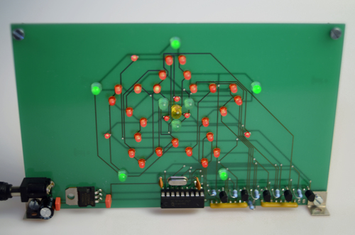
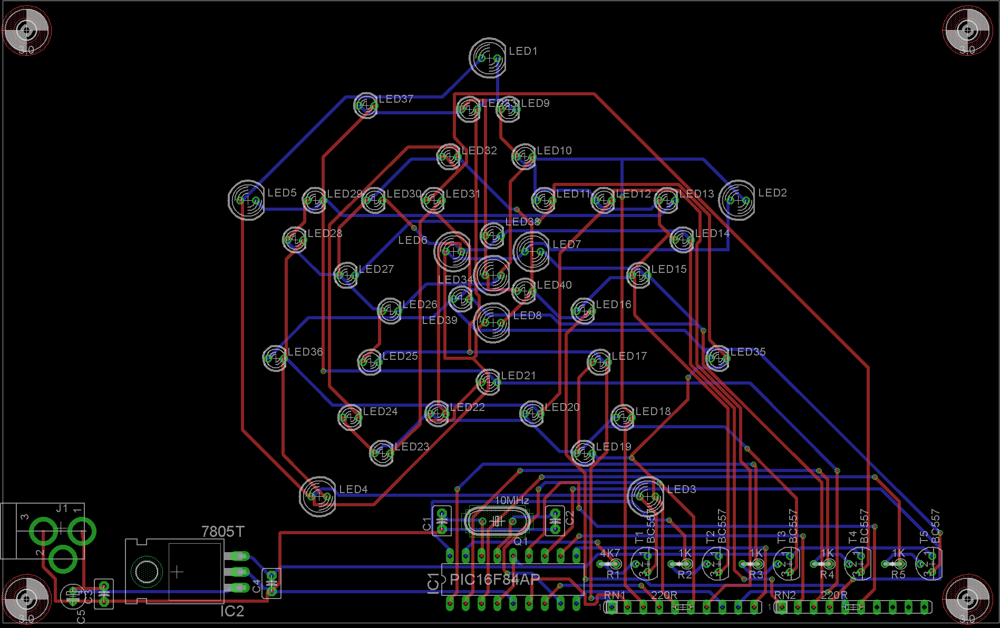

###Sternchen  

Little PCB displaying different animation sequences on a star-shaped led matrix.

###Tools

Microchip MPLAB

CCS-PICC C-Compiler

PCB made with CadSoft Eagle

###License

[BSD](LICENSE-BSD.txt) for software

[Creative Commons 4.0](LICENSE-CC.txt) for pcb and other artwork

###Copyright

Copyright (c) 2016 Bjoern Seip

